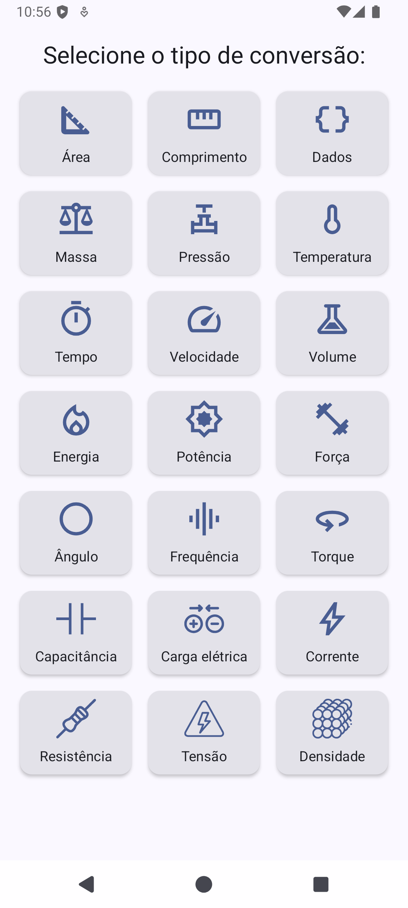
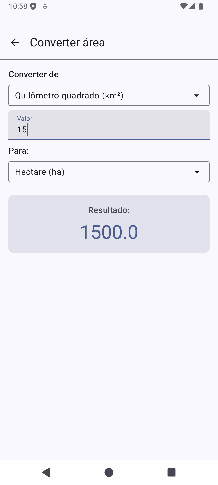

# Conversor de Unidades

Bem-vindo ao Conversor de Unidades – a ferramenta definitiva para todas as suas necessidades de conversão de unidades, diretamente no seu dispositivo Android!

Cansado de procurar conversores online ou fazer cálculos complexos manualmente? O Conversor de Unidades foi projetado para simplificar sua vida, oferecendo uma interface limpa, intuitiva e resultados precisos para uma vasta gama de unidades de medida. Ideal para estudantes, profissionais e para o uso no dia a dia!

## Por que escolher o Conversor de Unidades?

- **Ampla Cobertura de Unidades:** Converta facilmente entre dezenas de unidades nas categorias mais importantes. Nossa biblioteca inclui Medidas Fundamentais (Comprimento, Área, Volume, Massa, Densidade), Física e Engenharia (Velocidade, Aceleração, Força, Pressão, Energia, Potência, Torque, Temperatura), Eletricidade e Eletrônica (Tensão, Corrente, Resistência, Capacitância, Carga Elétrica), Computação (Dados) e Tempo/Relacionados (Tempo, Frequência, Ângulo).
- **Interface Intuitiva e Moderna:** Navegue com facilidade! O design é focado na simplicidade e na experiência do usuário, permitindo que você realize conversões rapidamente e sem complicações.
- **Pensado para o Brasil:**
    - **Entrada de Dados Flexível:** Digite seus valores usando a vírgula (,) como separador decimal, do jeito que você já está acostumado.
    - **Resultados Claros:** Os resultados são formatados para fácil leitura, utilizando a vírgula decimal e apresentando números muito grandes ou pequenos em notação científica quando apropriado.
- **Leve e Rápido:** Otimizado para performance, garantindo que suas conversões sejam instantâneas.
- **Sempre à Mão:** Tenha um poderoso conversor de unidades no seu bolso, acessível a qualquer momento, mesmo offline (para as conversões que não dependem de dados externos).

## Screenshots

 

## Categorias de Conversão Incluídas:

- Área (metro quadrado, hectare, pé quadrado, etc.)
- Comprimento (metro, quilômetro, milha, polegada, etc.)
- Dados (bit, byte, KB, MB, GB, TB, etc.)
- Massa (quilograma, grama, libra, onça, etc.)
- Pressão (Pascal, bar, psi, atm, etc.)
- Temperatura (Celsius, Fahrenheit, Kelvin)
- Tempo (segundo, minuto, hora, dia, ano, etc.)
- Velocidade (m/s, km/h, mph, nós, etc.)
- Volume (metro cúbico, litro, galão, ml, etc.)
- Energia (Joule, caloria, kWh, BTU, etc.)
- Potência (Watt, cavalo-vapor, hp, etc.)
- Força (Newton, kgf, lbf, etc.)
- Ângulo (grau, radiano, gradiano)
- Frequência (Hertz, RPM, rad/s, etc.)
- Torque (Newton-metro, lbf·ft, etc.)
- Capacitância (Farad, µF, pF, etc.)
- Carga Elétrica (Coulomb, Ah, carga elementar, etc.)
- Corrente Elétrica (Ampère, mA, µA, etc.)
- Resistência Elétrica (Ohm, kΩ, MΩ, etc.)
- Tensão Elétrica (Volt, mV, kV, etc.)
- Densidade (kg/m³, g/cm³, lb/ft³, etc.)

Estou sempre trabalhando para adicionar mais unidades e funcionalidades! Seu feedback é muito importante.
